## 3.6 盛典与慧业

|章节|标题|图片|
|---|---|---|
|智慧主之章 第二幕 归乡|归乡||
|智慧主之章 第二幕 归乡|归乡||
|悬壶之章 第一幕 「医心」|长生|[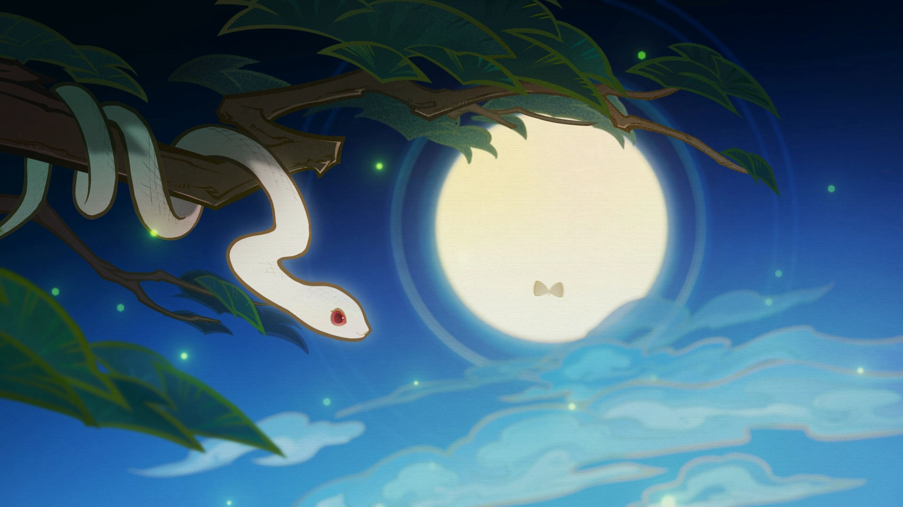](https://github.com/xunkong/cutscene/releases/download/3.6/Cs_Liyue_LQ1102907_LC.mkv)|
|盛典与慧业|荣冕|[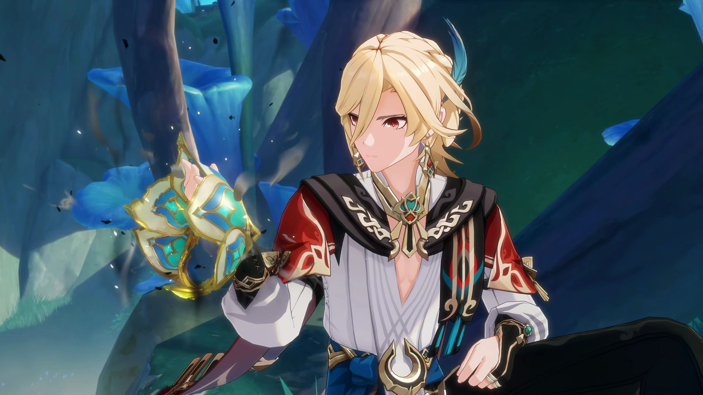](https://github.com/xunkong/cutscene/releases/download/3.6/Cs_Sumeru_EQ4010309_KWG.mkv)|

## 3.5 风花的呼吸

|章节|标题|图片|
|---|---|---|
|风花的呼吸|魔女的茶会||

## 3.4 磬弦奏华夜

|章节|标题|图片|
|---|---|---|
|磬弦奏华夜|余音萦心||
|磬弦奏华夜|虹歌灯宴||
|磬弦奏华夜|虹歌灯宴||
|天隼之章 第一幕 乌合的虚像|||
|天隼之章 第一幕 乌合的虚像|||

## 3.3 六入尽明，诸相皆无

|章节|标题|图片|
|---|---|---|
|间章 第三幕 倾落伽蓝||[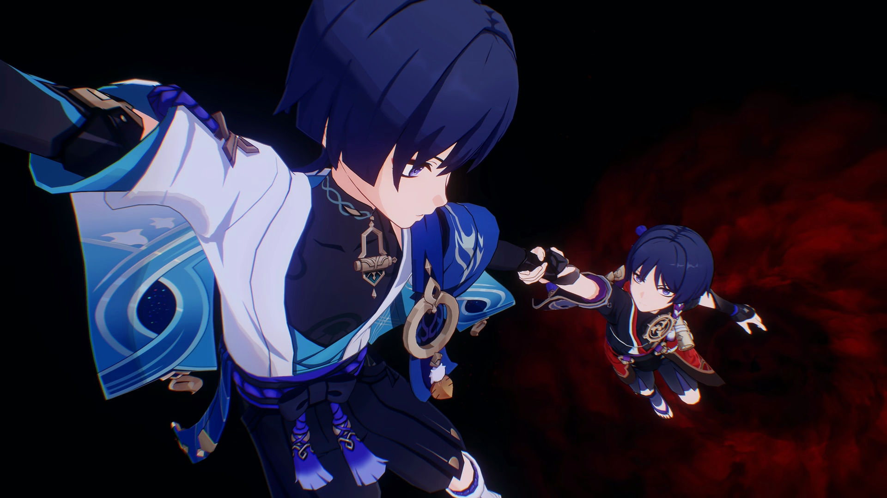](https://github.com/xunkong/cutscene/releases/download/3.3/Cs_Sumeru_AQ_30310701_HB_Boy.mkv)|
|间章 第三幕 倾落伽蓝|||
|秋津森夜试胆会|秋津羽戏·上|[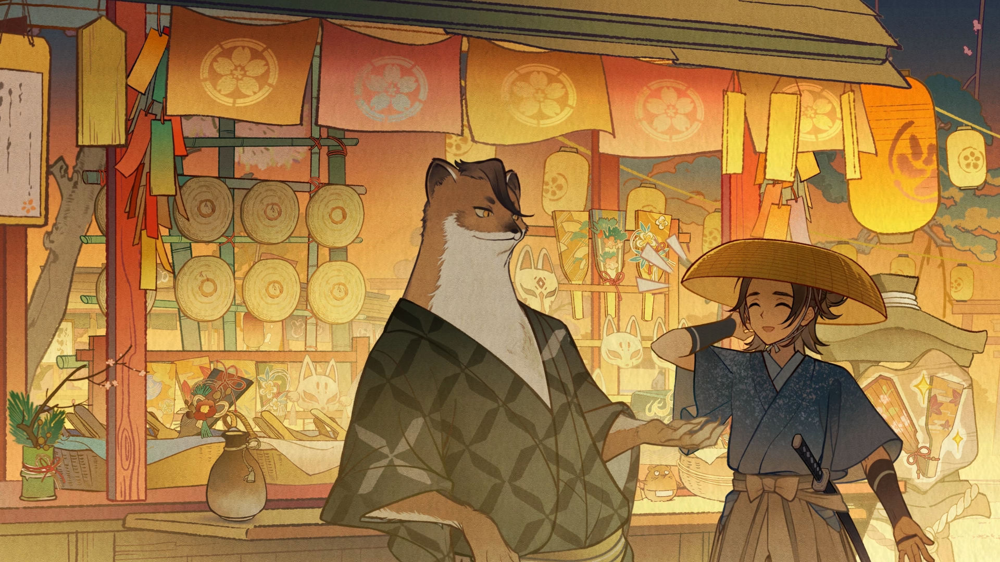](https://github.com/xunkong/cutscene/releases/download/3.3/Cs_Inazuma_EQ_4009004_DYG1.mkv)|
|秋津森夜试胆会|秋津羽戏·下|[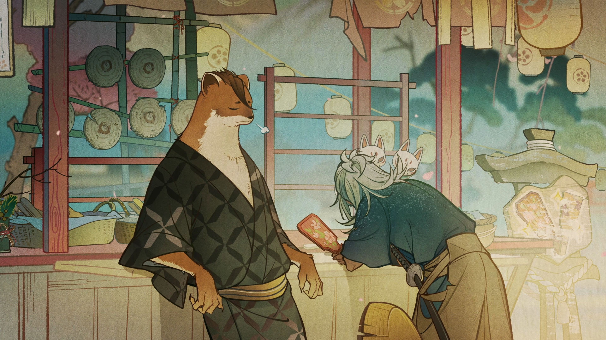](https://github.com/xunkong/cutscene/releases/download/3.3/Cs_Inazuma_EQ_4009114_DYG2.mkv)|

## 3.2 虚空鼓动，劫火高扬

|章节|标题|图片|
|---|---|---|
|须弥 第五幕 虚空鼓动，劫火高扬|||
|须弥 第五幕 虚空鼓动，劫火高扬||[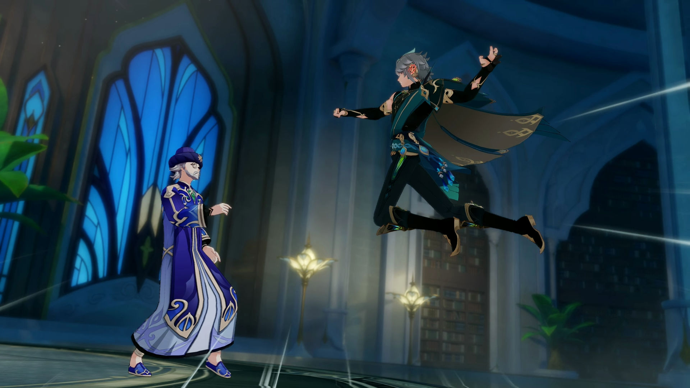](https://github.com/xunkong/cutscene/releases/download/3.2/Cs_Sumeru_AQ30220701_ALC_Girl.mkv)|
|须弥 第五幕 虚空鼓动，劫火高扬|||
|须弥 第五幕 虚空鼓动，劫火高扬|||
|须弥 第五幕 虚空鼓动，劫火高扬|||
|须弥 第五幕 虚空鼓动，劫火高扬|布耶尔最初的贤者||
|须弥 第五幕 虚空鼓动，劫火高扬|布耶尔最初的贤者||
|须弥 第五幕 虚空鼓动，劫火高扬||[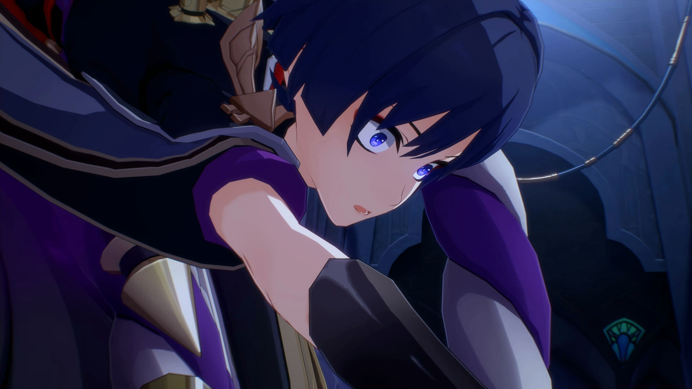](https://github.com/xunkong/cutscene/releases/download/3.2/Cs_Sumeru_AQ_30281101_NBS_Boy.mkv)|
|须弥 第五幕 虚空鼓动，劫火高扬|||
|须弥 第五幕 虚空鼓动，劫火高扬|折枝落梦||

## 3.1 赤土之王与三朝圣者

|章节|标题|图片|
|---|---|---|
|须弥 第三幕 迷梦与空幻与欺骗|||
|须弥 第三幕 迷梦与空幻与欺骗|||
|须弥 第三幕 迷梦与空幻与欺骗|『神』意||
|须弥 第三幕 迷梦与空幻与欺骗|禅那园变故||
|须弥 第三幕 迷梦与空幻与欺骗|禅那园变故||
|须弥 第四幕 赤土之王与三朝圣者|||
|须弥 第四幕 赤土之王与三朝圣者||[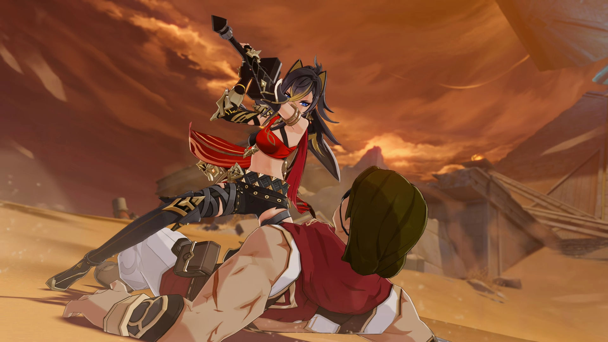](https://github.com/xunkong/cutscene/releases/download/3.1/Cs_Sumeru_AQ302103_FOTD_Girl.mkv)|
|须弥 第四幕 赤土之王与三朝圣者|沙中遗事|[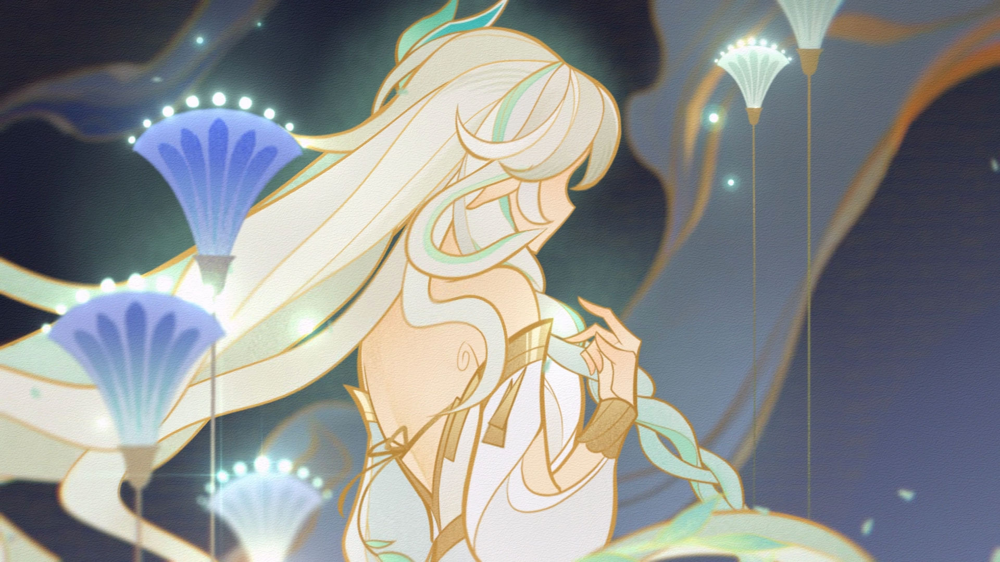](https://github.com/xunkong/cutscene/releases/download/3.1/Cs_Sumeru_AQ302105_GOTP.mkv)|
|金狼之章 第一幕 沉沙归寂||[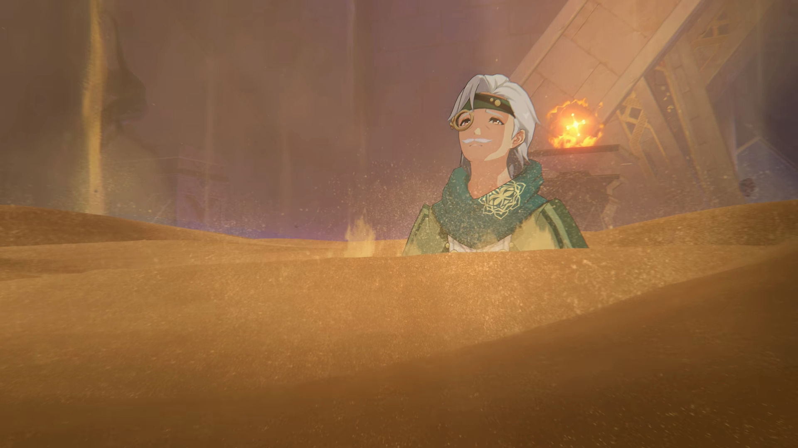](https://github.com/xunkong/cutscene/releases/download/3.1/Cs_Sumeru_LQ130111201_EnODeGa_Boy.mkv)|
|金狼之章 第一幕 沉沙归寂||[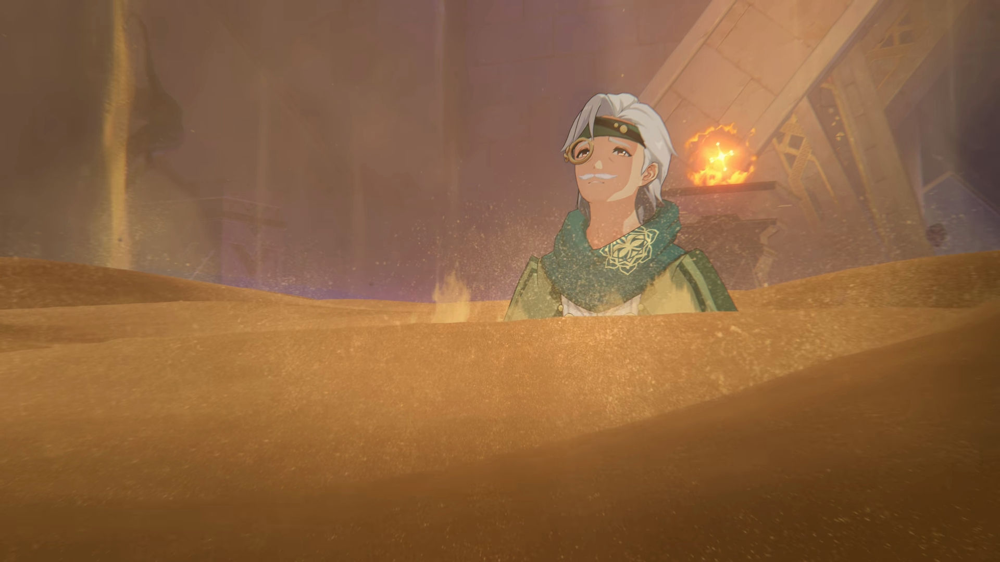](https://github.com/xunkong/cutscene/releases/download/3.1/Cs_Sumeru_LQ130111201_EnODeGa_Girl.mkv)|
|杯中遥吟之歌|待风归，启佳酿||
|杯中遥吟之歌|待风归，启佳酿|[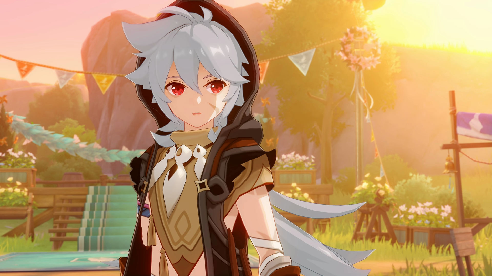](https://github.com/xunkong/cutscene/releases/download/3.1/Cs_MD_EQ400800601_VinFes_Girl.mkv)|

## 3.0 千朵玫瑰带来的黎明

|章节|标题|图片|
|---|---|---|
|须弥 第一幕 穿越烟帏与暗林||[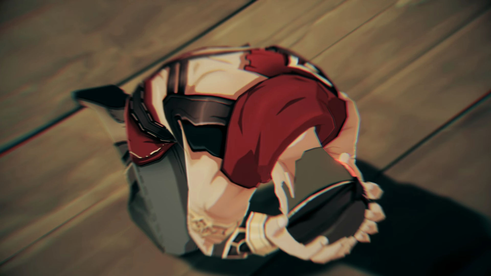](https://github.com/xunkong/cutscene/releases/download/3.0/Cs_Sumeru_AQ302009_MOTM.mkv)|
|须弥 第一幕 穿越烟帏与暗林|||
|须弥 第一幕 穿越烟帏与暗林||[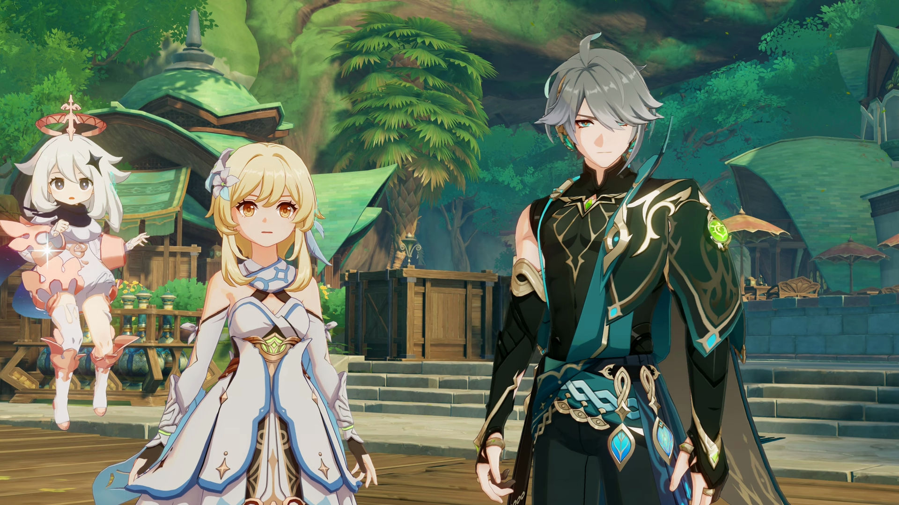](https://github.com/xunkong/cutscene/releases/download/3.0/Cs_Sumeru_AQ30061401_ALPlay_Girl.mkv)|
|须弥 第二幕 千朵玫瑰带来的黎明|花神之舞||
|须弥 第二幕 千朵玫瑰带来的黎明|花神之舞||

## 2.8 仲夏！幻夜？奇想曲！

|章节|标题|图片|
|---|---|---|
|远海诗夏游纪|||
|远海诗夏游纪|||
|远海诗夏游纪|辉金盛夏·枫原万叶||
|远海诗夏游纪|辉金盛夏·辛焱||
|远海诗夏游纪|辉金盛夏·菲谢尔||
|远海诗夏游纪|辉金盛夏·莫娜||

## 2.7 荒梦藏虞渊

|章节|标题|图片|
|---|---|---|
|间章 第二幕 危途疑踪|生死一刹||
|间章 第二幕 危途疑踪|生死一刹||
|间章 第二幕 危途疑踪|惟余旧忆||
|幽客之章 第一幕 棋生断处|||
|幽客之章 第一幕 棋生断处|||

## 2.6 流风眷堇庭

|章节|标题|图片|
|---|---|---|
|旅人 第二章 第四幕 回响渊底的安魂曲|||
|旅人 第二章 第四幕 回响渊底的安魂曲|||
|堇庭华彩真说|歌仙逸话|[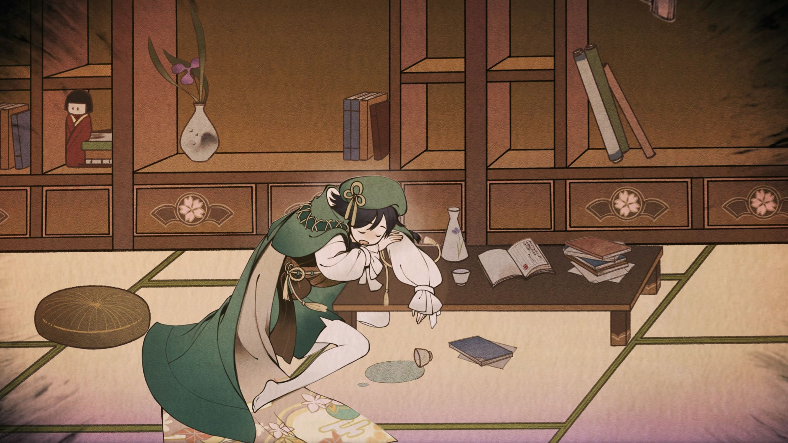](https://github.com/xunkong/cutscene/releases/download/2.6/Cs_Inazuma_EQ400551201_IRODORI_Suikou.mkv)|
|堇庭华彩真说|歌仙逸话|[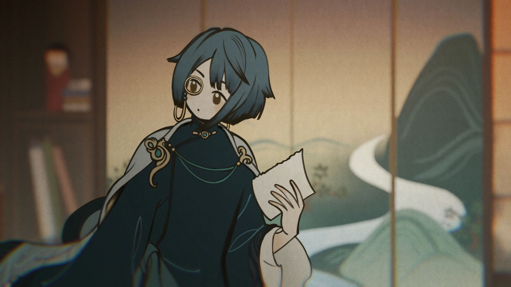](https://github.com/xunkong/cutscene/releases/download/2.6/Cs_Inazuma_EQ400560901_IRODORI_Aoinookina.mkv)|
|堇庭华彩真说|歌仙逸话|[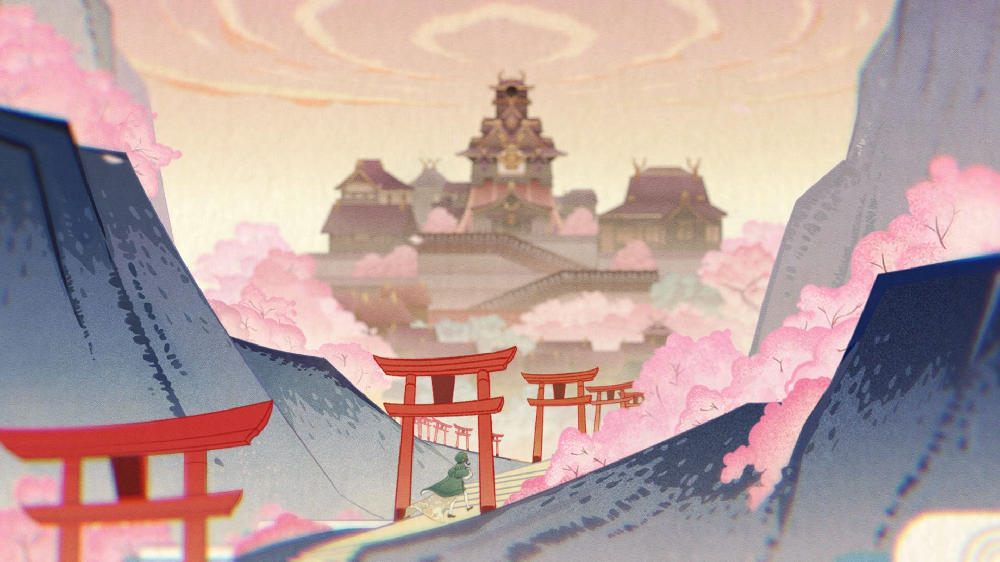](https://github.com/xunkong/cutscene/releases/download/2.6/Cs_Inazuma_EQ400571101_IRODORI.mkv)|

## 2.5 薄樱初绽时

|章节|标题|图片|
|---|---|---|
|天下人之章 第二幕 须臾百梦||[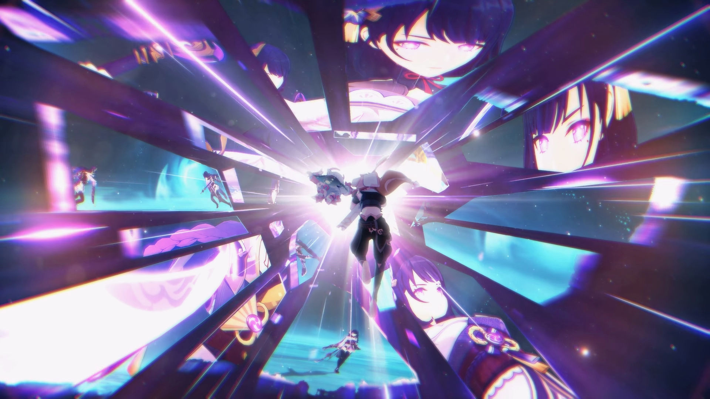](https://github.com/xunkong/cutscene/releases/download/2.5/Cs_Inazuma_LQ1204205_IntoTheVoid_Boy.mkv)|
|天下人之章 第二幕 须臾百梦||[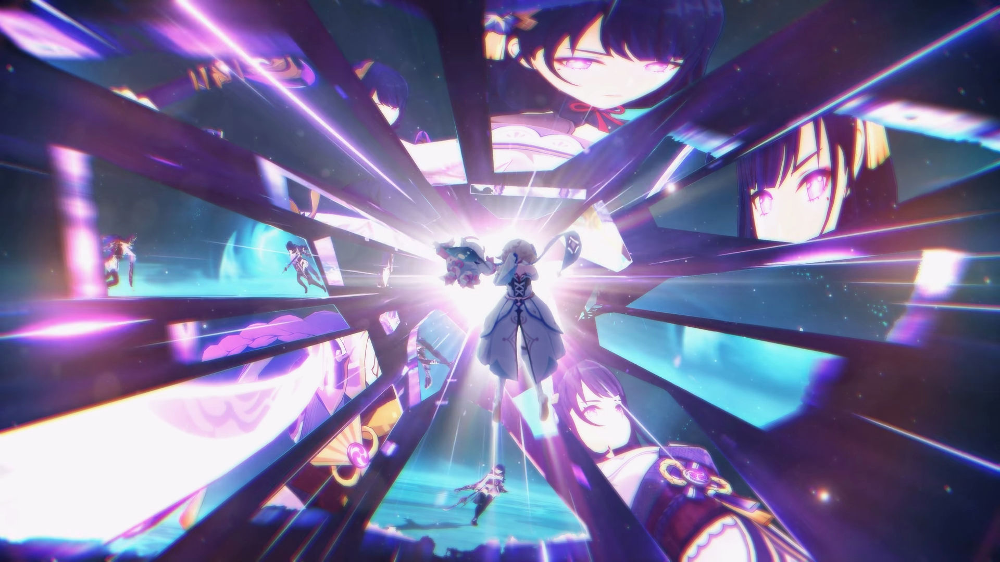](https://github.com/xunkong/cutscene/releases/download/2.5/Cs_Inazuma_LQ1204205_IntoTheVoid_Girl.mkv)|
|天下人之章 第二幕 须臾百梦|||
|天下人之章 第二幕 须臾百梦|||
|仙狐之章 第一幕 鸣神御袚祈愿祭||[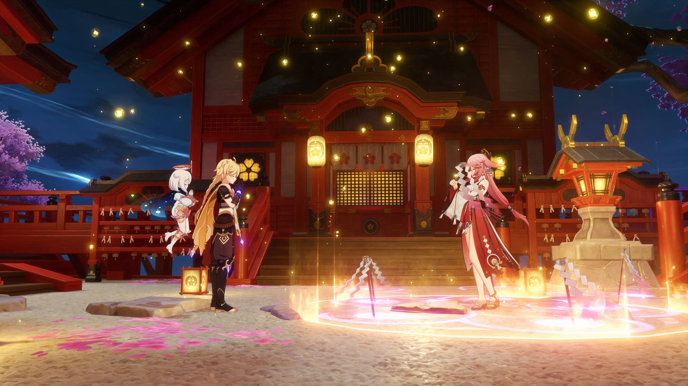](https://github.com/xunkong/cutscene/releases/download/2.5/Cs_Inazuma_LQ1203105_YaeMiko_Boy.mkv)|
|仙狐之章 第一幕 鸣神御袚祈愿祭||[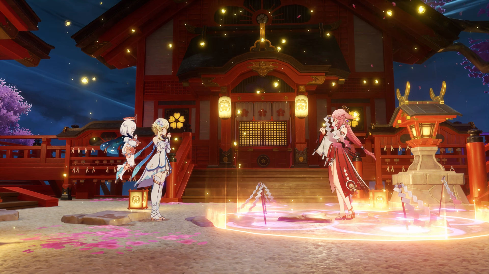](https://github.com/xunkong/cutscene/releases/download/2.5/Cs_Inazuma_LQ1203105_YaeMiko_Girl.mkv)|
|三界路飨祭||[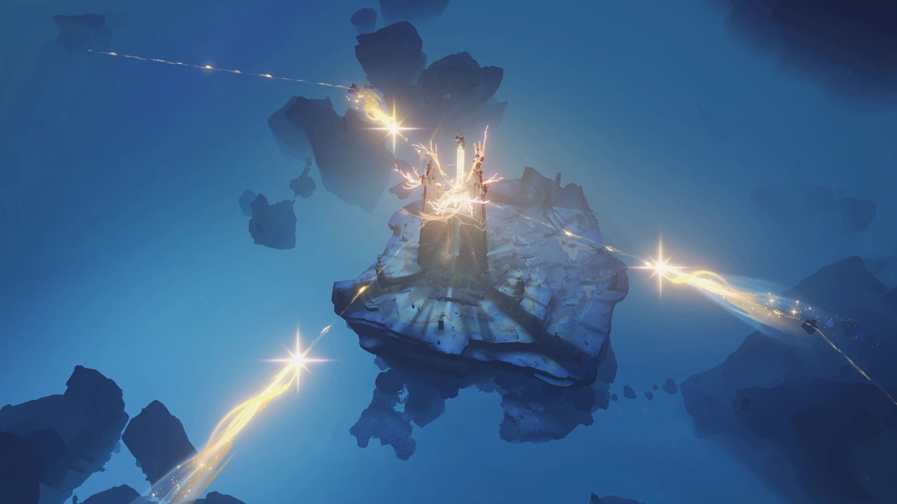](https://github.com/xunkong/cutscene/releases/download/2.5/Cs_Inazuma_EQ4005111_MichiaeMatsuri.mkv)|

## 2.4 飞彩镌流年

|章节|标题|图片|
|---|---|---|
|间章 第一幕 风起鹤归|||
|间章 第一幕 风起鹤归|||
|间章 第一幕 风起鹤归|神女劈观|[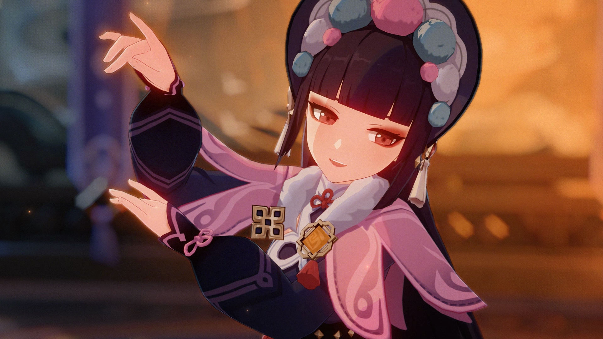](https://github.com/xunkong/cutscene/releases/download/2.4/Cs_LQ1101505_YunjinOpera_Boy.mkv)|
|间章 第一幕 风起鹤归|神女劈观||
|飞彩镌流年|岁华流彩||
|飞彩镌流年|岁华流彩||

## 2.3 皑尘与雪影

|章节|标题|图片|
|---|---|---|
|天牛之章 第一幕 赤金魂||[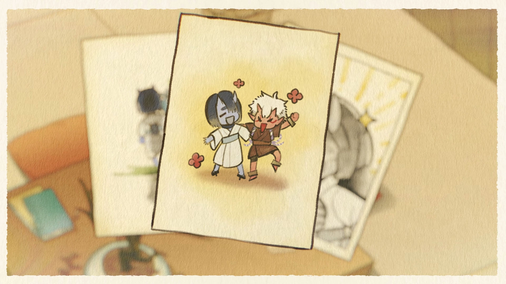](https://github.com/xunkong/cutscene/releases/download/2.3/Cs_Inazuma_LQ1200905_IttoOniStroy01.mkv)|
|天牛之章 第一幕 赤金魂||[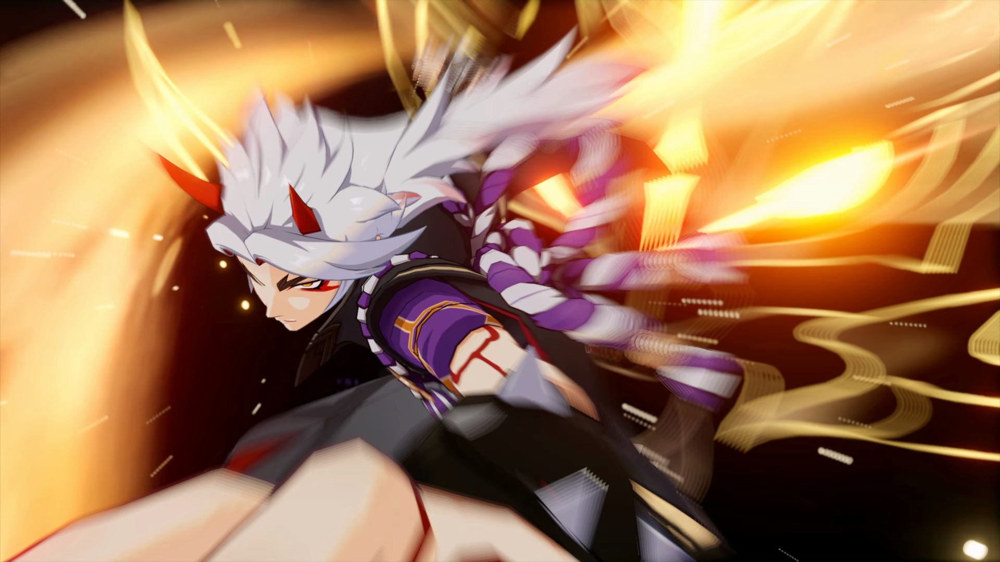](https://github.com/xunkong/cutscene/releases/download/2.3/Cs_Inazuma_LQ1202615_IttoDungeonCrash_Boy.mkv)|
|天牛之章 第一幕 赤金魂|||
|天牛之章 第一幕 赤金魂|||
|皑尘与雪影 皑尘与雪影||[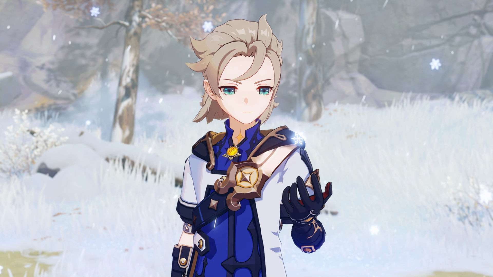](https://github.com/xunkong/cutscene/releases/download/2.3/Cs_MD_EQ4002802_WinterCampAlbedoConfront.mkv)|
|皑尘与雪影 皑尘与雪影|||
|皑尘与雪影 皑尘与雪影|||

## 2.2 雾海悬谜境

|章节|标题|图片|
|---|---|---|
|谜境悬兵|||
|谜境悬兵||[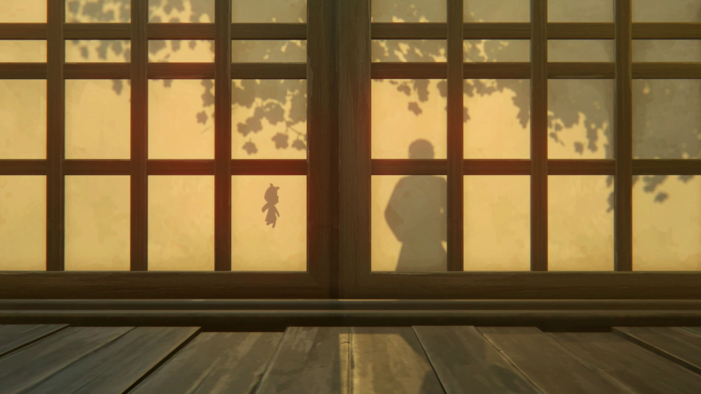](https://github.com/xunkong/cutscene/releases/download/2.2/Cs_Inazuma_EQ4002207_ShikishogunRecalling_Girl.mkv)|

## 2.1 韶光抚月，天下人间

|章节|标题|图片|
|---|---|---|
|稻妻 第二幕 无念无想，泡影断灭||[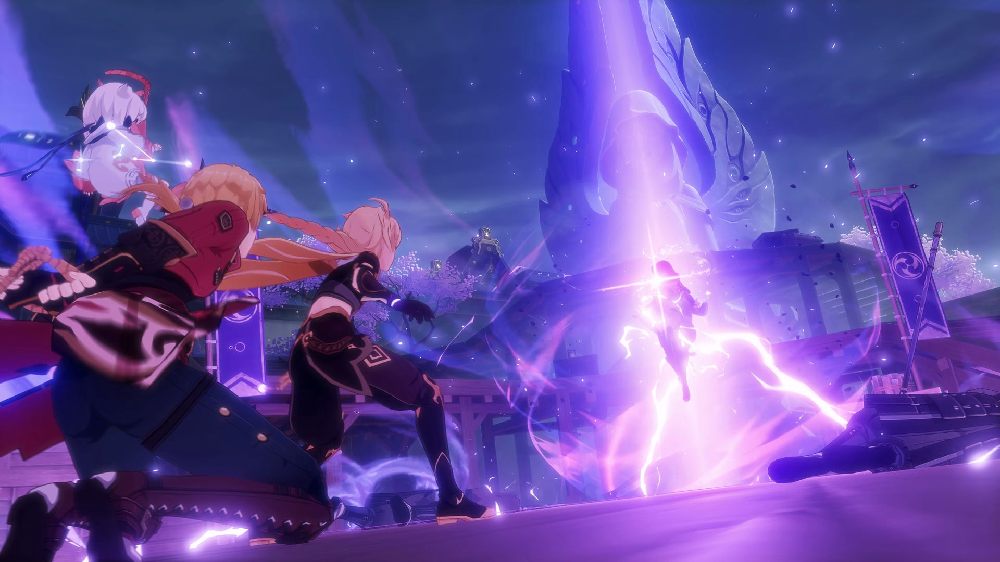](https://github.com/xunkong/cutscene/releases/download/2.1/Cs_200803_ShougunBossPart1_Boy.mkv)|
|稻妻 第二幕 无念无想，泡影断灭||[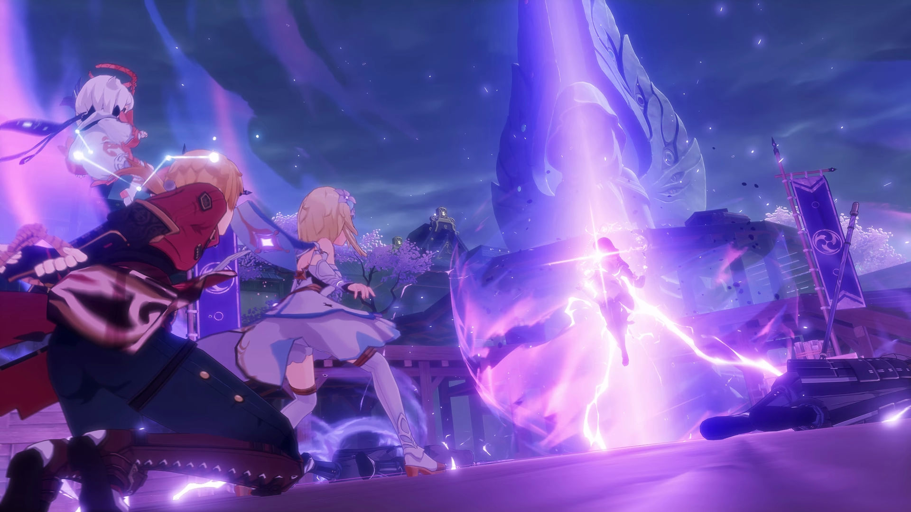](https://github.com/xunkong/cutscene/releases/download/2.1/Cs_200803_ShougunBossPart1_Girl.mkv)|
|稻妻 第二幕 无念无想，泡影断灭||[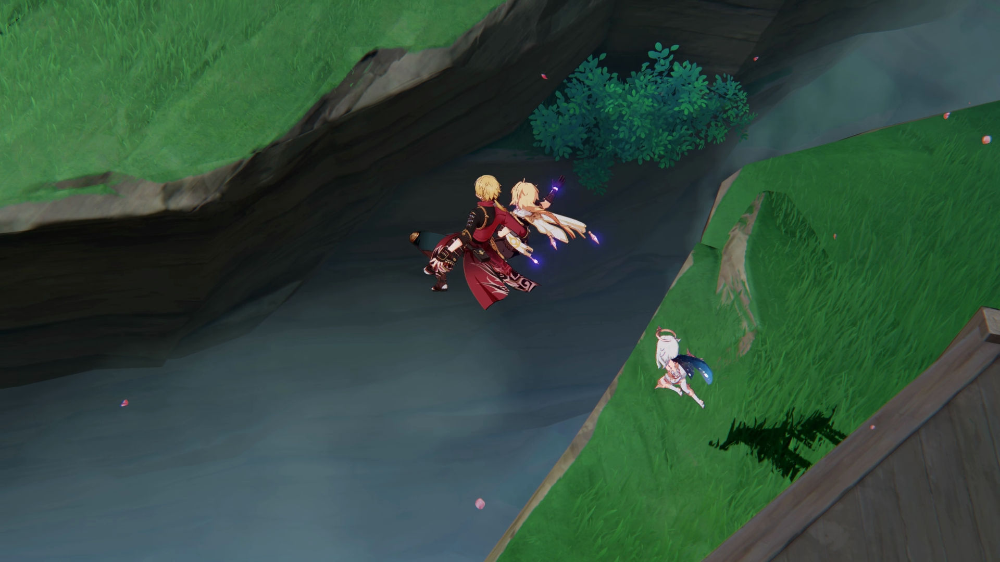](https://github.com/xunkong/cutscene/releases/download/2.1/Cs_200806_ShougunBossPart2_Boy.mkv)|
|稻妻 第二幕 无念无想，泡影断灭||[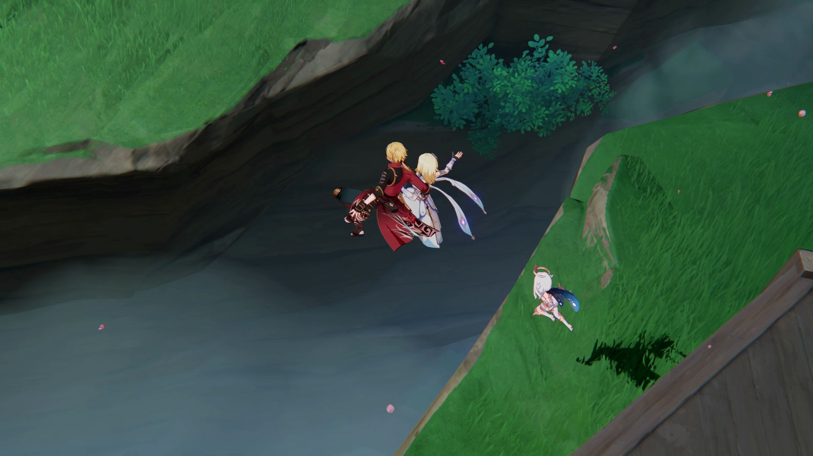](https://github.com/xunkong/cutscene/releases/download/2.1/Cs_200806_ShougunBossPart2_Girl.mkv)|
|稻妻 第二幕 无念无想，泡影断灭|||
|稻妻 第二幕 无念无想，泡影断灭|||
|稻妻 第三幕 千手百眼，天下人间|||
|稻妻 第三幕 千手百眼，天下人间||[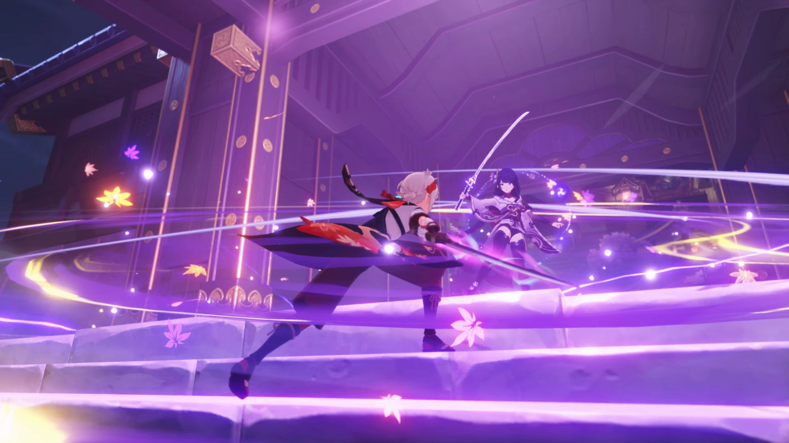](https://github.com/xunkong/cutscene/releases/download/2.1/Cs_Inazuma_AQ202004_ResistanceCharge_Girl.mkv)|
|稻妻 第三幕 千手百眼，天下人间|||
|稻妻 第三幕 千手百眼，天下人间|||
|稻妻 第三幕 千手百眼，天下人间|许以臣民之梦||
|稻妻 第三幕 千手百眼，天下人间||[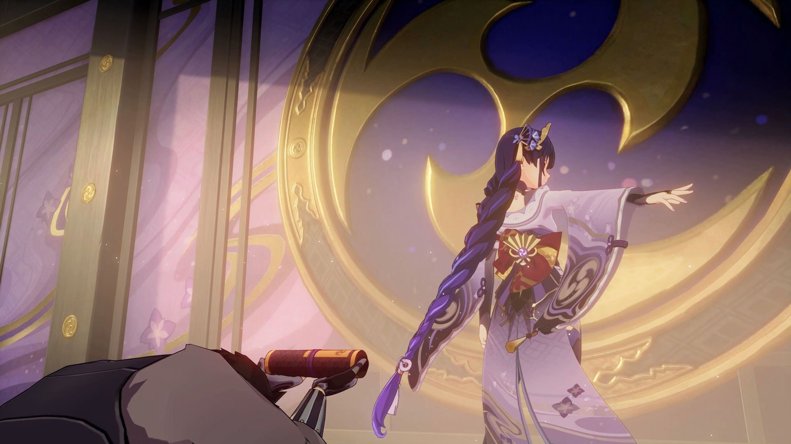](https://github.com/xunkong/cutscene/releases/download/2.1/Cs_Inazuma_AQ202006_InazumaEnding.mkv)|
|韶光抚月|人间至味||
|韶光抚月|人间至味||

## 2.0 不动鸣神，泡影断灭

|章节|标题|图片|
|---|---|---|
|稻妻 第一幕 不动鸣神，恒常乐土||[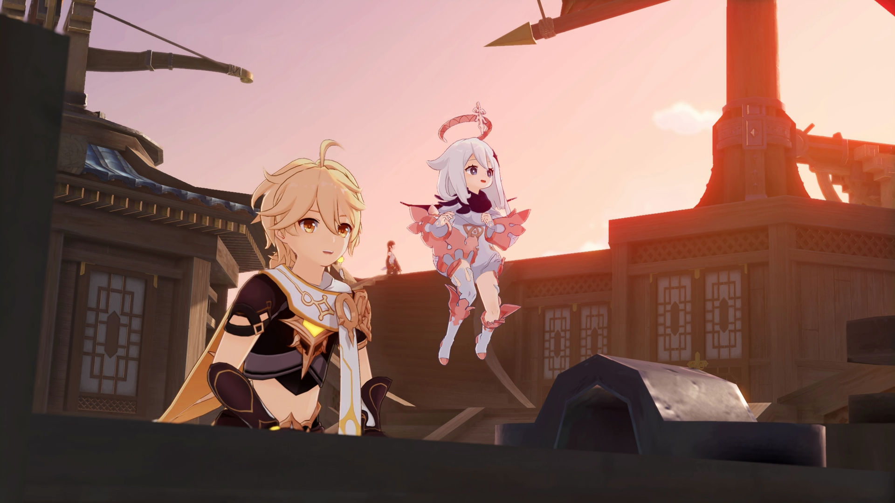](https://github.com/xunkong/cutscene/releases/download/2.0/Cs_201104_DaoQiDengdao_P2_Boy.mkv)|
|稻妻 第一幕 不动鸣神，恒常乐土||[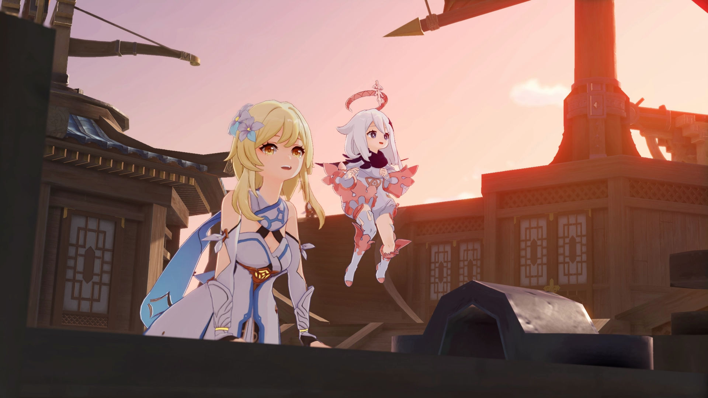](https://github.com/xunkong/cutscene/releases/download/2.0/Cs_201104_DaoQiDengdao_P2_Girl.mkv)|
|雪鹤之章 第一幕 鹤与白兔的诉说||[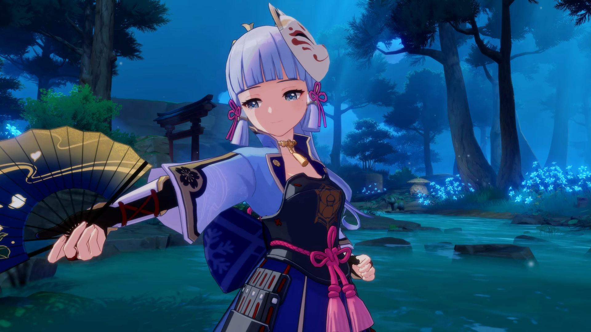](https://github.com/xunkong/cutscene/releases/download/2.0/Cs_LQ12008_Ayaka_Boy.mkv)|
|雪鹤之章 第一幕 鹤与白兔的诉说|||

## 1.6 盛夏！海岛？大冒险！

|章节|标题|图片|
|---|---|---|
|稻妻 序幕 振袖秋风问红叶|追逐霆光的孤旅|[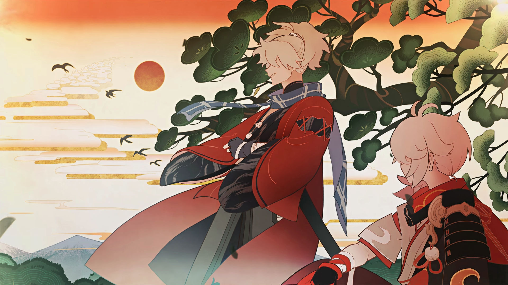](https://github.com/xunkong/cutscene/releases/download/1.6/Cs_200211_WanYeXianVideo.mkv)|
|盛夏！海岛？大冒险！|||
|盛夏！海岛？大冒险！|||

## 1.5 玉扉绕尘歌

|章节|标题|图片|
|---|---|---|
|古闻之章 第二幕 匪石|创龙点睛||

## 1.4 风花的邀约

|章节|标题|图片|
|---|---|---|
|旅人 第一章 第四幕 我们终将重逢||[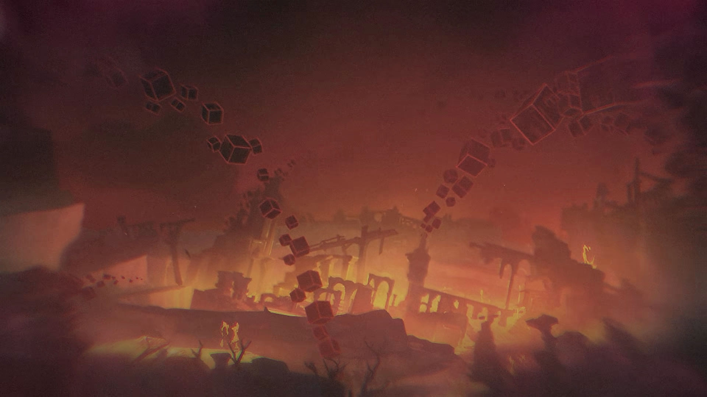](https://github.com/xunkong/cutscene/releases/download/1.4/Cs_WQDY1800026_Memories.mkv)|
|风花的邀约|万花成风||
|风花的邀约|万花成风||

## 1.3 明霄升海平

|章节|标题|图片|
|---|---|---|
|金翅鹏王之章 第一幕 槐柯胡蝶，傩佑之梦|护法仙众夜叉录||
|海灯节|汇成明霄||
|海灯节|汇成明霄||

## 1.2 白垩与黑龙

|章节|标题|图片|
|---|---|---|
|仙麟之章 第一幕 云之海，人之海||[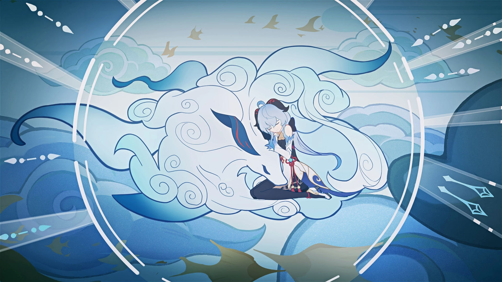](https://github.com/xunkong/cutscene/releases/download/1.2/Cs_GY11030_GYPersonal.mkv)|

## 1.1 迫近的客星

|章节|标题|图片|
|---|---|---|
|璃月 第三幕 迫近的客星||[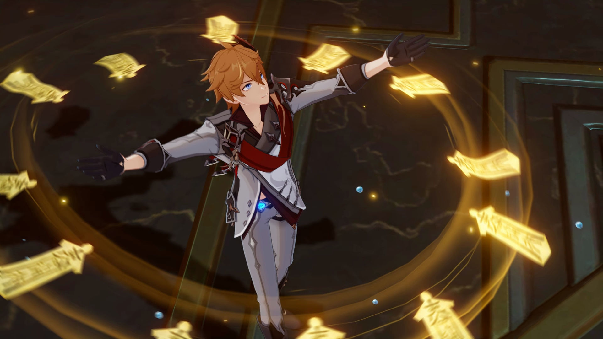](https://github.com/xunkong/cutscene/releases/download/1.1/Cs_102106_Summon_Boy.mkv)|
|璃月 第三幕 迫近的客星||[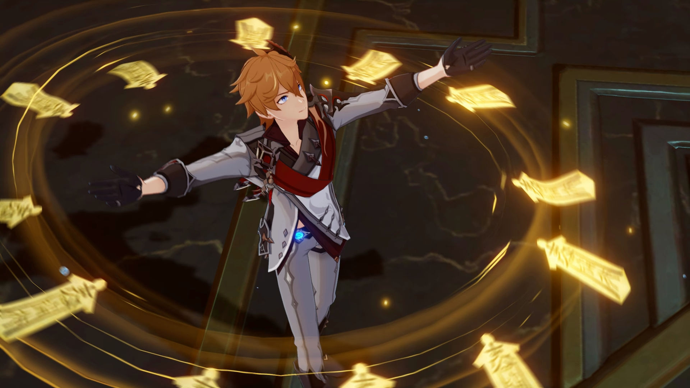](https://github.com/xunkong/cutscene/releases/download/1.1/Cs_102106_Summon_Girl.mkv)|
|璃月 第三幕 迫近的客星|      ||
|璃月 第三幕 迫近的客星|      |[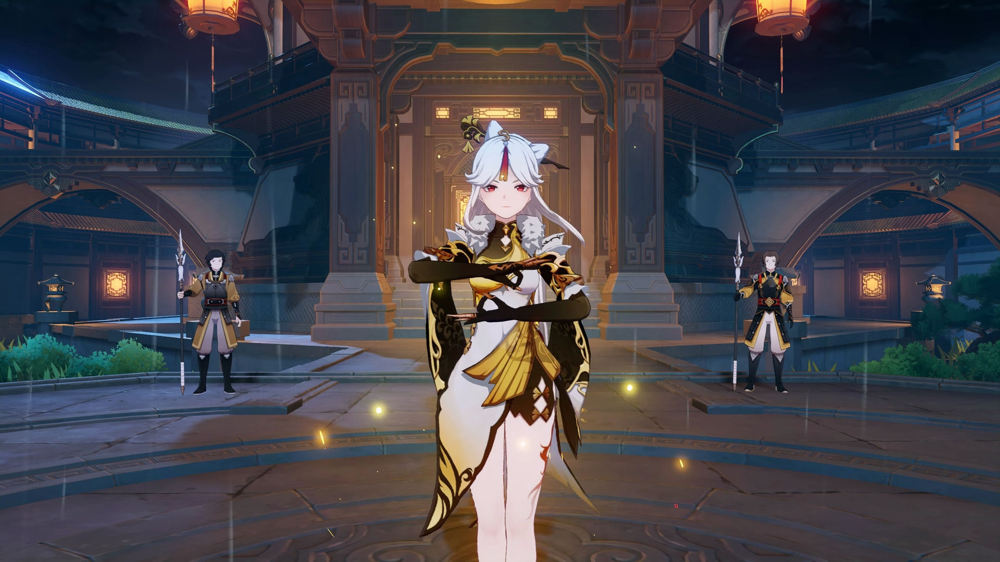](https://github.com/xunkong/cutscene/releases/download/1.1/Cs_102203_BeforeBattle_Girl.mkv)|
|璃月 第三幕 迫近的客星|||
|璃月 第三幕 迫近的客星|      |[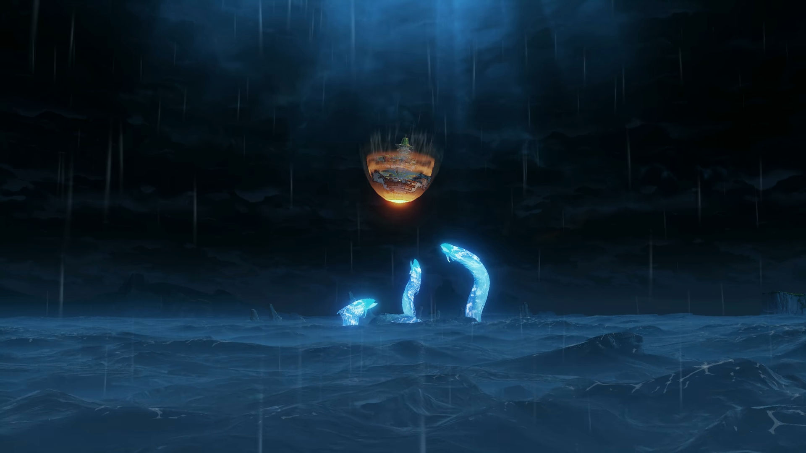](https://github.com/xunkong/cutscene/releases/download/1.1/Cs_102205_AfterBattle_Girl.mkv)|
|未归的熄星||[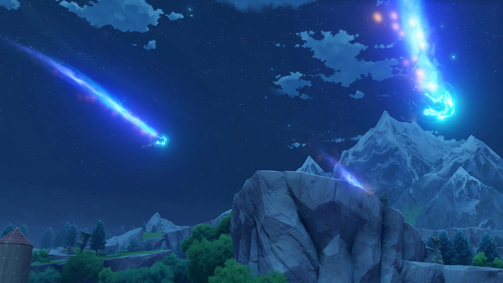](https://github.com/xunkong/cutscene/releases/download/1.1/Cs_EQAST4101101_ASTER_OP.mkv)|
|未归的熄星|      |[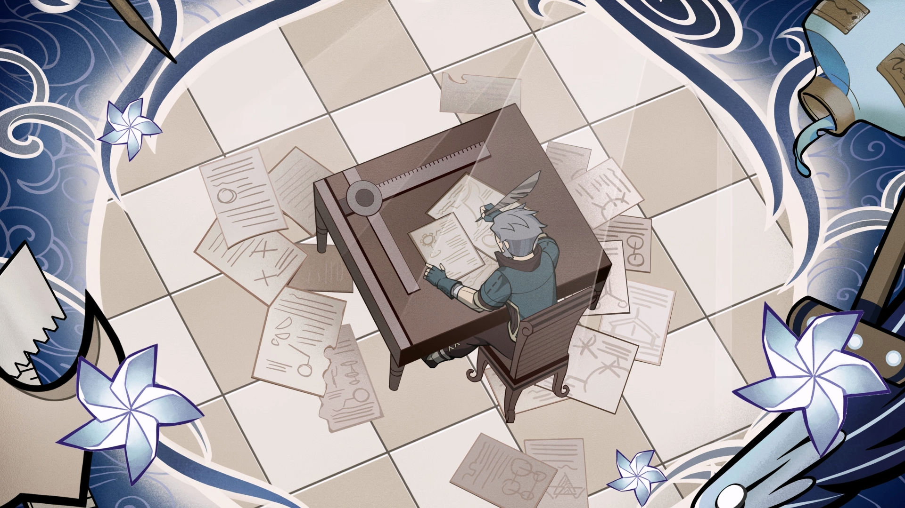](https://github.com/xunkong/cutscene/releases/download/1.1/Cs_EQAST4111412_ASTER_Lenard.mkv)|

## 1.0 捕风的异乡人

|章节|标题|图片|
|---|---|---|
|珍珠之歌|珍珠之歌||
|蒙德 第一幕 捕风的异乡人|空中荧火·上|[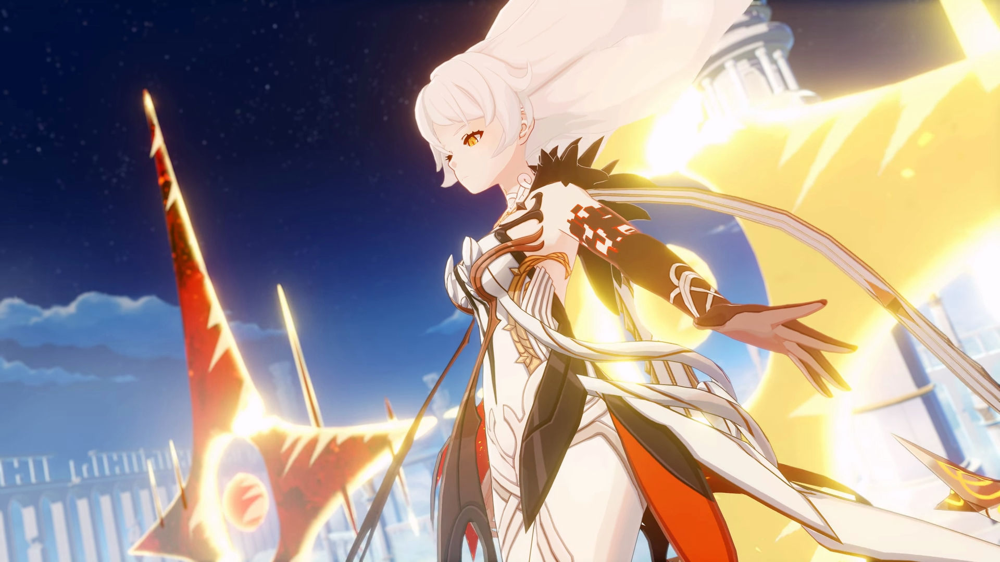](https://github.com/xunkong/cutscene/releases/download/1.0/Cs_MDAQ001_OPNew_Part1.mkv)|
|蒙德 第一幕 捕风的异乡人|空中荧火·下|[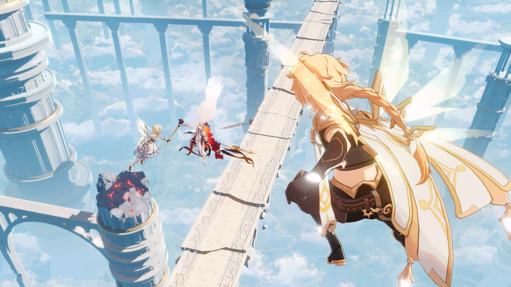](https://github.com/xunkong/cutscene/releases/download/1.0/Cs_MDAQ001_OPNew_Part2_PlayerBoy.mkv)|
|蒙德 第一幕 捕风的异乡人|空中荧火·下|[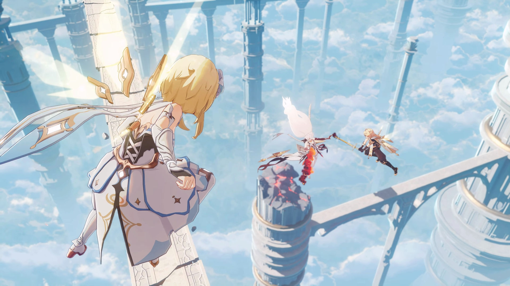](https://github.com/xunkong/cutscene/releases/download/1.0/Cs_MDAQ001_OPNew_Part2_PlayerGirl.mkv)|
|蒙德 第一幕 捕风的异乡人|||
|蒙德 第一幕 捕风的异乡人||[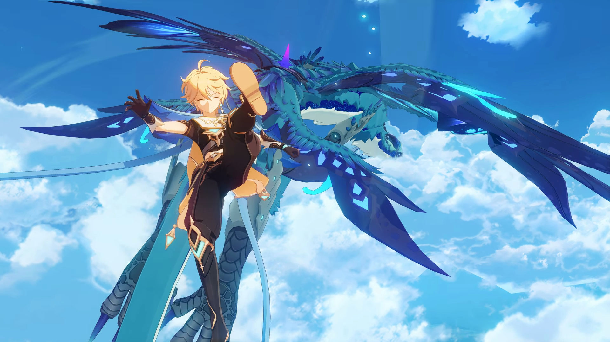](https://github.com/xunkong/cutscene/releases/download/1.0/Cs_MDAQ019_DragonInCity_Boy.mkv)|
|蒙德 第一幕 捕风的异乡人||[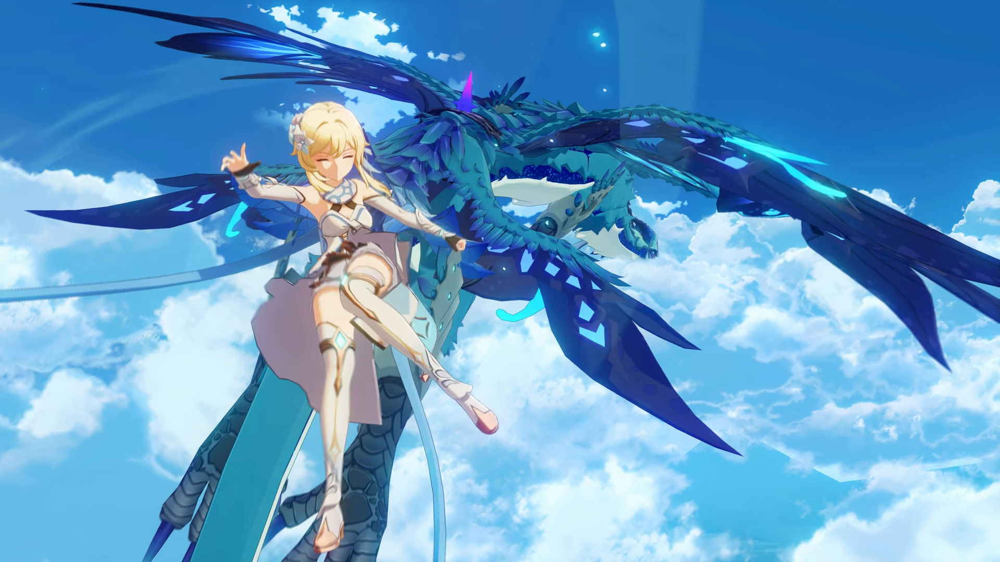](https://github.com/xunkong/cutscene/releases/download/1.0/Cs_MDAQ019_DragonInCity_Girl.mkv)|
|蒙德 第一幕 捕风的异乡人|             |[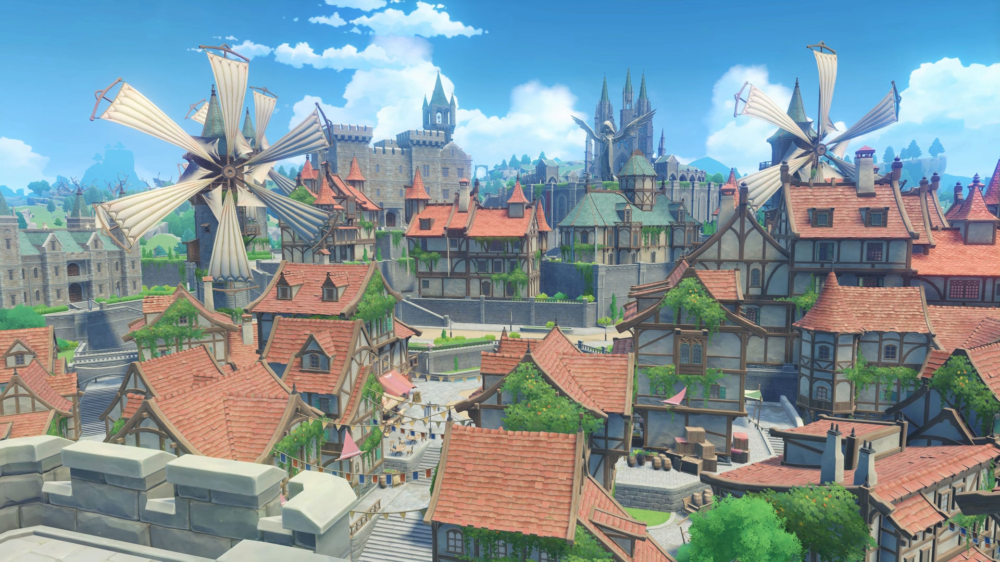](https://github.com/xunkong/cutscene/releases/download/1.0/Cs_ChangeWeather.mkv)|
|蒙德 第二幕 为了没有眼泪的明天||[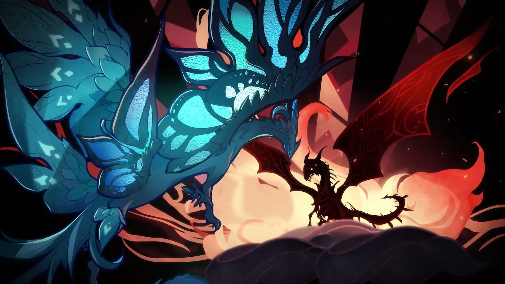](https://github.com/xunkong/cutscene/releases/download/1.0/Cs_MDAQ041.mkv)|
|蒙德 第二幕 为了没有眼泪的明天|||
|蒙德 第二幕 为了没有眼泪的明天||[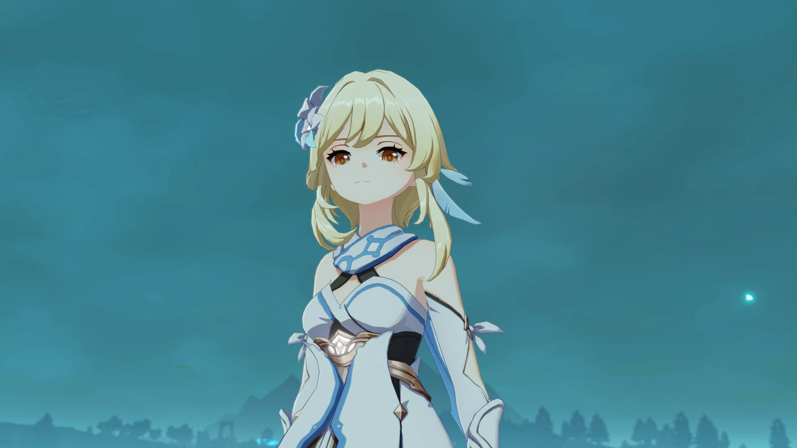](https://github.com/xunkong/cutscene/releases/download/1.0/Cs_MDAQ063_ZhaiXingYaSideB_Girl.mkv)|
|蒙德 第三幕 巨龙与自由之歌|||
|蒙德 第三幕 巨龙与自由之歌|||
|璃月 第二幕 辞行久远之躯|天权为尊||
|歌仙之章 第一幕 若你困于无风之地|微风与少年|[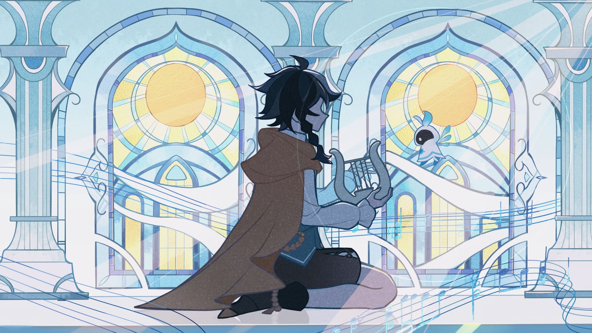](https://github.com/xunkong/cutscene/releases/download/1.0/Cs_WDLQ004_VentiLegends.mkv)|
|小兔之章 第一幕 风、勇气和翅膀|飞行指南|[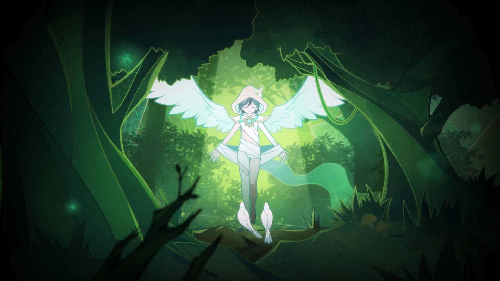](https://github.com/xunkong/cutscene/releases/download/1.0/Cs_Ambor_Readings.mkv)|